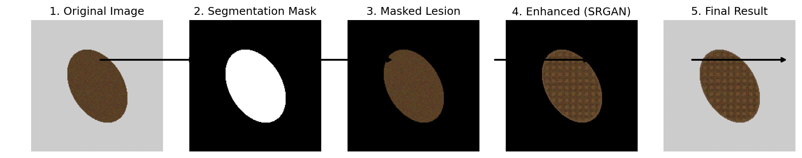
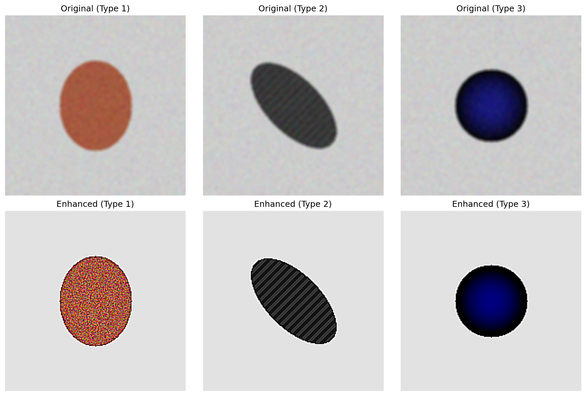
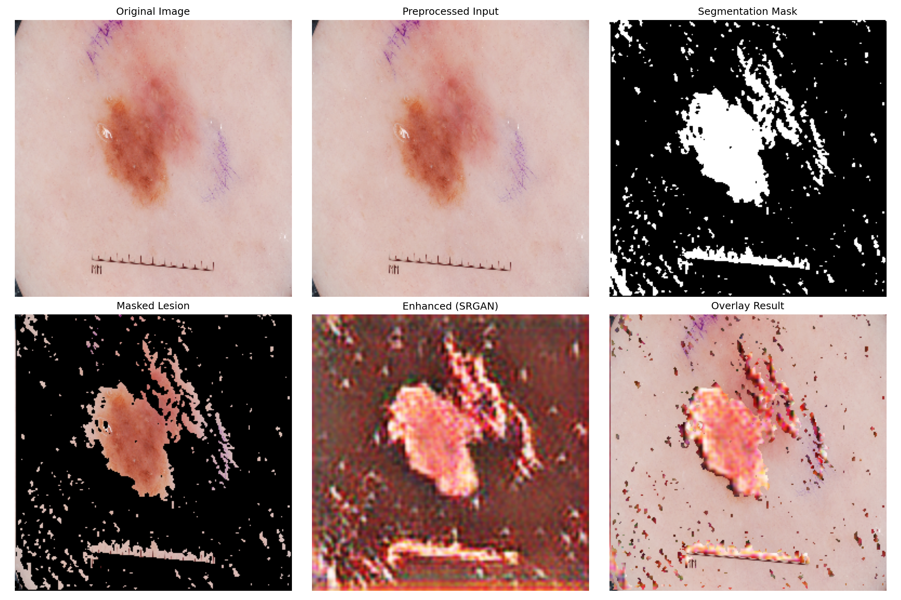

# SkinSegmentSRGAN: Skin Disease Segmentation and Enhancement Pipeline



## Overview

SkinSegmentSRGAN is an advanced medical image processing pipeline that combines semantic segmentation and super-resolution techniques to enhance the visualization of skin disease images. The pipeline consists of two main components:

1. **Segmentation Module**: A U-Net based architecture that accurately segments skin lesions from surrounding healthy tissue.
2. **Super-Resolution Module**: A Super-Resolution Generative Adversarial Network (SRGAN) that enhances the visual details of the segmented lesions.

This pipeline is particularly useful for dermatologists and medical professionals who need to analyze low-contrast or low-resolution skin disease images for more accurate diagnosis.

## Features

- Accurate segmentation of skin lesions using a customizable U-Net architecture
- High-quality image enhancement using SRGAN
- End-to-end pipeline for processing skin disease images
- Command-line interface for easy usage
- Comprehensive visualization of results
- Support for batch processing of multiple images

## Installation

### Prerequisites

- Python 3.10
- TensorFlow 2.10+
- CUDA-compatible GPU (recommended for training)

### Setup

1. Clone the repository:
   ```bash
   git clone https://github.com/yourusername/skinsegmentsrgan.git
   cd skinsegmentsrgan
   ```

   Create Virtual environment:
   ```bash
   python3.10 -m venv venv
   ```

2. Install dependencies:
   ```bash
   pip install -r requirements.txt
   ```

3. Create necessary directories:
   ```bash
   mkdir -p data/{raw,processed}/{segmentation,srgan}/{train,val,test}
   mkdir -p models/{segmentation,srgan}
   mkdir -p results/pipeline
   ```

## Data Preparation

### Directory Structure

The expected data directory structure is:

```
data/
├── raw/
│   ├── segmentation/
│   │   ├── images/
│   │   └── masks/
│   └── srgan/
│       ├── HR/
│       └── LR/
└── processed/
    ├── segmentation/
    │   ├── train/
    │   │   ├── images/
    │   │   └── masks/
    │   ├── val/
    │   │   ├── images/
    │   │   └── masks/
    │   └── test/
    │       ├── images/
    │       └── masks/
    └── srgan/
        ├── train/
        │   ├── hr/
        │   └── lr/
        ├── val/
        │   ├── hr/
        │   └── lr/
        └── test/
            ├── hr/
            └── lr/
```

### Generating Segmentation Masks

If you don't have ground truth masks for your skin disease images, you can generate them using our pre-trained model:

```bash
python -m src.data_processing.generate_masks
```

### Preprocessing Data

1. Preprocess segmentation data:
   ```bash
   python -m src.data_processing.preprocess_seg
   ```

2. Preprocess SRGAN data:
   ```bash
   python -m src.data_processing.preprocess_srgan
   ```

3. Update metadata database:
   ```bash
   python -m src.utils.logger
   ```

## Model Training

### Training the Segmentation Model

```bash
python -m src.training.seg_train
```

Configuration options can be modified in `configs/segmentation.yaml`.

### Training the SRGAN Model

```bash
python -m src.training.srgan_train
```

Configuration options can be modified in `configs/srgan.yaml`.

## Inference

### Using the Command-Line Interface

Process a single image:
```bash
PYTHONPATH=. python src/inference/cli.py -i samples/metrics/0161/0161.png   --seg-model models/final_model.h5   --srgan-model models/generator_epoch_100.h5   -o results/inference_results
```

Process all images in a directory:
```bash
python -m src.inference.cli --directory path/to/images/
```

### Using the Shell Script

```bash
./scripts/run_inference.sh --input data/raw/test_images
```

Additional options:
```
Usage: ./scripts/run_inference.sh [OPTIONS]
Run the skin disease segmentation + SRGAN pipeline on test images.

Options:
  -i, --input DIR      Input directory containing test images
  -s, --seg-model PATH Path to segmentation model weights
  -g, --srgan-model PATH Path to SRGAN generator model weights
  -o, --output DIR     Output directory for results
  -h, --help           Show this help message
```

## Results

The pipeline generates several outputs for each processed image:

1. Segmentation mask
2. Masked lesion image
3. Enhanced lesion image
4. Visualization of the complete pipeline process

Example results:



## Evaluation

We evaluate our models using the following metrics:

### Segmentation Model
- Dice Coefficient
- Intersection over Union (IoU)
- Precision and Recall

### SRGAN Model
- Peak Signal-to-Noise Ratio (PSNR)
- Structural Similarity Index (SSIM)
- Perceptual quality assessment




## Contributing

Contributions are welcome! Please feel free to submit a Pull Request.

## License

This project is licensed under the MIT License - see the LICENSE file for details.

## Citation

If you use this code for your research, please cite our paper:

```
@article{author2023skinsegmentsrgan,
  title={SkinSegmentSRGAN: A Combined Segmentation and Super-Resolution Approach for Enhanced Visualization of Skin Disease Images},
  author={Author, A. and Researcher, B.},
  journal={Journal of Medical Imaging},
  year={2023}
}
```

## Acknowledgments

- The segmentation model architecture is based on the U-Net paper by Ronneberger et al.
- The SRGAN implementation is inspired by the original SRGAN paper by Ledig et al.

